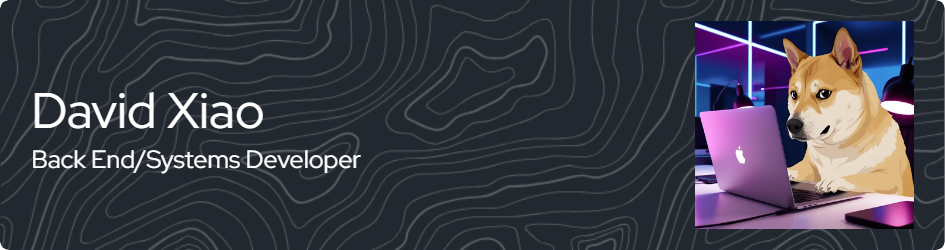

    

<table align='center' style="width:90%; margin:auto; border-collapse:separate; border-spacing:10px; text-align:center; font-family:'Arial', sans-serif; background-color:#f9f9f9; box-shadow: 0px 4px 8px rgba(0, 0, 0, 0.1); border-radius: 10px;">
    <tr>
        <td style="padding:15px;">
            
        </td>
        <td style="padding:15px;">
            
        </td>
    </tr>
</table>

## Testing Projects

    
    
    
    

## Testing Technologies

### Programming Languages

### Skills

### Tools

### Systems & Systems Security

### Miscellaneous
  

## My GitHub Stats

 

|  |
| ------------------------- |

